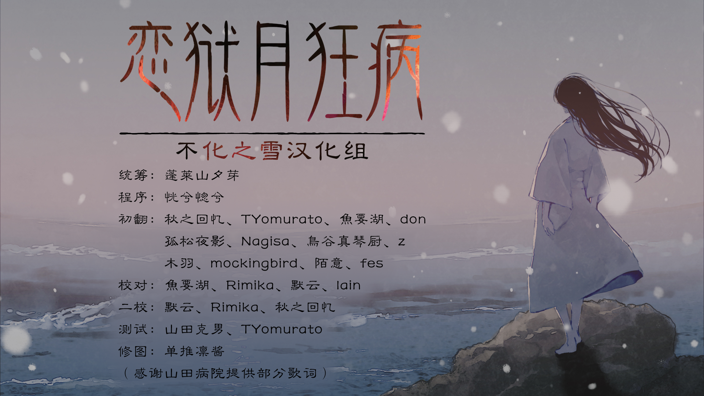

序言： 
那个少女与大海融为了一体。 
她在海中随波浮沉，被宁静的大海怀抱。 
虽渴望死亡，但却被大海的温柔慰藉，无法实现死亡的愿望。 
海陪伴着孤独少女的心灵。 
 
只有海能治愈少女，并允许她继续存活于世。 
尽管如泡沫般消逝便可轻松解脱， 
但对爱的渴望却不允许她这样做。 
从未被爱过的少女，渴望着被人所爱。 
渴望着与灵魂共鸣的邂逅—— 
然后，少女遇见了她命中注定的人。 
 

—————以下是汉化补丁相关————

 
■制作人员 Staff: 
统筹：蓬莱山夕芽 
程序：恍兮惚兮 
初翻：秋之回忆、TYomurato、魚要湖、don、孤松夜影、Nagisa、鳥谷真琴厨、z、木羽、mockingbird、陌意、fes 
校对：魚要湖、Rimika、默云、lain 
二校：默云、Rimika、秋之回忆 
修图：单推凛酱 
测试：加里、TYomurato、等 
（人员排名不分先后） 
感谢 山田病院 提供部分歌词  
感谢其他未署名人士对本汉化的热心帮助 
 
 
注意事项： 
1.本游戏版权归Innocent Grey会社所有，汉化补丁版权不化之雪汉化组所有。 
2.因不遵守本声明而导致需承担相关法律责任的，当事人产生的一切行为与本汉化组及参与制作补丁人员无关！ 
3.本补丁完全免费，禁止用于任何形式的商业用途！！！如果您以购买的方式获取到本补丁，请给倒卖的卖家差评并退款举报。 
4.本补丁为不化之雪汉化组制作并单独发布，与IG吧等贴吧组织或其他团体无任何关联。本补丁仅供日语学习与交流使用，如喜欢此游戏，请务必合法购买正版游戏使用。 
5.未经允许禁止拆解、修改、提取汉化文本，直播、录播游戏内容，本组保留对盗用人员追究的权利。 
6.请勿通过非ACG网站或日本地区转载本补丁，本补丁仅发布于galgame吧与绯月论坛，如需转载请附上原贴地址。 
7.请务必在任何情况下都保证本声明文档与本补丁的一体性。 
 

